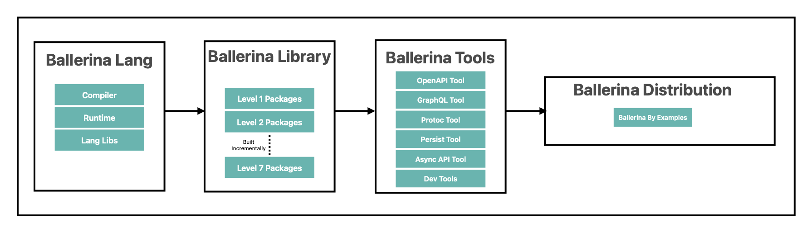

# What is Ballerina Platform?

Ballerina platform is a complete platform built around the Ballerina ecosystem. There are many components that fits together to create the Ballerina platform.

Following are the main components of the Ballerina platform.

- Ballerina language
- Ballerina Libraries
- Ballerina Tools
- Ballerina Distribution

## Components of Ballerina Platform

Ballerina platform release consists of multiple components across multiple repositories. This section describes the main components of the Ballerina platform and the repositories that are related to each component.

<figure>
  
  <figcaption>Ballerina Platform Repository Structure</figcaption>
</figure>

### Ballerina Language

This is the heart of the Ballerina platform. It includes the Ballerina compiler, the Ballerina runtime, and the Ballerina language server. The source repository of the Ballerina language is [ballerina-lang](https://github.com/ballerina-platform/ballerina-lang). All the issues related to Ballerina language are reported and tracked in this repository.

If you want to contribute to the Ballerina Language repository, you can find the issues in the [ballerina-lang](https://github.com/ballerina-platform/ballerina-lang) repository. There are issues with the label [`good first issue`](https://github.com/ballerina-platform/ballerina-lang/issues?q=is%3Aissue+is%3Aopen+sort%3Aupdated-desc+label%3A%22good+first+issue%22) which are ideal for first time contributors. You can also pick any other issue that you are interested in and start contributing.

### Ballerina Library

The Ballerina library consists of the Ballerina packages maintained by the Ballerina team and the Ballerina community. Each Ballerina library has its own repository. All the issues related to the Ballerina libraries are reported and tracked in the [Ballerina Library](https://github.com/ballerina-platform/ballerina-standard-library) repository.

If you want to contribute to a particular Ballerina library package, you can find the relevant issues in the [Ballerina Library](https://github.com/ballerina-platform/ballerina-standard-library) repository. Issues are labeled with the relevant package name. For example, if you are interested in contributing to the `ballerina/http` package, you can find the relevant issues by searching for the [`module/http`](https://github.com/ballerina-platform/ballerina-standard-library/issues?q=is%3Aissue+is%3Aopen+sort%3Aupdated-desc+label%3Amodule%2Fhttp) label. There are issues labeled with `good first issue` label, which are ideal for first time contributors. You can also pick any other issue that you are interested in and start contributing.

Once you select an issue to work on, you can find the relevant repository from the [Ballerina Library Dashboard](https://github.com/ballerina-platform/ballerina-standard-library#status-dashboard). Clone that repository and follow the instructions provided in the repository to build the package. If you need to build the Ballerina Distribution locally, you need to publish the package to the local maven repository. You can do this by running the following command from the root of the repository.

### Ballerina Tools

Ballerina tools includes the various tools that are used to improve the Ballerina developer experience. Following are some of the tools that are included in the Ballerina distribution.

- [Open API tool](https://github.com/ballerina-platform/openapi-tools)
- [GraphQL tool](https://github.com/ballerina-platform/graphql-tools)
- [Protoc tool](https://github.com/ballerina-platform/protoc-tools)
- [Persist tool](https://github.com/ballerina-platform/persist-tools)
- [Async API tool](https://github.com/ballerina-platform/asyncapi-tools)
- [Dev tools](https://github.com/ballerina-platform/ballerina-dev-tools)

All the issues related to the Ballerina tools are reported and tracked in the respective repositories.

### Ballerina Distribution

The [Ballerina Distribution](https://github.com/ballerina-platform/ballerina-distribution) repository is where the Ballerina distribution is built. It composes the Ballerina language, Ballerina libraries, and the Ballerina tools together and generates the Ballerina Distribution for multiple platforms. All the issues related to the Ballerina distribution are reported and tracked in this repository itself.

The Ballerina Distribution repository also includes the [Ballerina by Example](https://ballerina.io/learn/by-example/) pages. The examples are located under the `examples` directory. You can contribute to improve the examples as well. Issues related to Ballerina Distribution are tracked in the [Ballerina Distribution](https://github.com/ballerina-platform/ballerina-distribution) repository.

## Building Ballerina Repositories

Each of the aforementioned repositories can be built independently, using the instructions provided in the respective repositories. Each repository have their own set of tests and CI/CD processes to ensure the quality of the code.

### Building the Ballerina Distribution

If you want to build the complete Ballerina Distribution, the following steps should be followed.

>**Note:** This is not required if you are only interested in contributing to a specific component of the Ballerina platform. In that case, you only need to build the specific component that you are interested in.

#### Building Ballerina Lang

First step of building the Ballerina distribution is to build the [ballerina-lang](https://github.com/ballerina-platform/ballerina-lang) repository. If you want to build the Ballerina Distribution locally, you need to build the Ballerina Language locally and publish it to the local maven repository. You can do this by running the following command from the root of the `ballerina-lang` repository.

```shell
./gradlew clean build publishToMavenLocal
```

#### Building Ballerina Library

Next step is to build the Ballerina library. The list of repositories that are included in the Ballerina library can be found in the [Ballerina Library](https://github.com/ballerina-platform/ballerina-standard-library#ballerina-modules). Each of the Ballerina library package has its own level, based on their dependencies. Lower the level means that the package has less dependencies.

>**Note:** If you are only interested in contributing to a specific Ballerina library package, you can build that specific package and skip the rest of the packages.

If you are building the Ballerina distribution from scratch, you need to build the Ballerina library incrementally, starting from the lowest level.

>**Tip:** If you are interested in building the whole Ballerina library, you can use the [Ballerina Library Build Script](https://github.com/ballerina-platform/ballerina-standard-library/tree/main/resources/scripts) to build all the library packages incrementally.

#### Building Ballerina Tools

Next step is to build the Ballerina tools. If you need to build a particular Ballerina tools repository, follow the instructions provided in the `README.me` file in repository. The issues related to Ballerina tools are tracked in the respective repositories.

#### Building Ballerina Distribution

Finally you can build the Ballerina Distribution by following the instructions provided in the `README.md` file in the Ballerina Distribution repository. The issues related to Ballerina Distribution are tracked in the [Ballerina Distribution](https://github.com/ballerina-platform/ballerina-distribution/issues?q=is%3Aissue+is%3Aopen+sort%3Aupdated-desc) repository.

## Contributing to Ballerina Platform

If you are interested in contributing to the Ballerina platform, you can pick one of the above components and start contributing. Follow the `CONTRIBUTING.md` file in the respective repository to learn more about the contribution process.

As a contributor, you are encouraged to ask for help when you need it and to help other users who need assistance. If you are looking for contribution related help, you can reach out to us via one of our communication channels.

- [Ballerina Discord Server](https://discord.gg/ballerinalang)
- [StackOverflow](https://stackoverflow.com/questions/tagged/ballerina)
