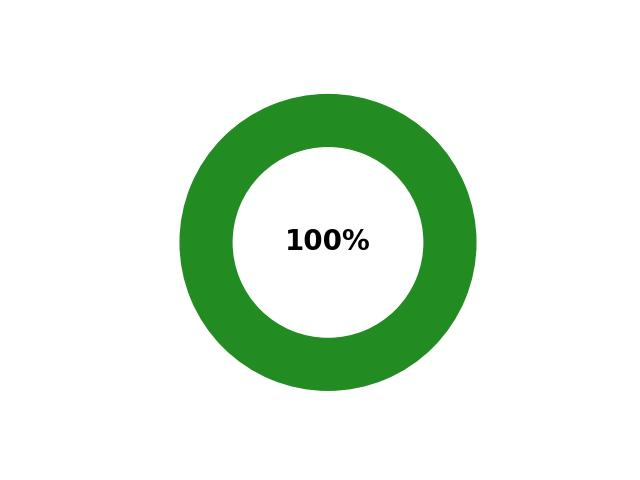

# Ballerina Repositories Update Status

<table><tbody><tr>
<td align='center'></td>
<td align='center'>
<code>ballerina-distribution</code> repository is up to date.  
<code>ballerina-lang</code> repository version <b>2201.0.1-rc3.1</b> has been updated as follows
</td>
</tr></tbody></table> 

 ## Ballerina Standard Library
| Level | Modules | Build | Lag Status | Pending Automated PR |
|:---:|:---:|:---:|:---:|:---:|
| 1 | [io](https://github.com/ballerina-platform/module-ballerina-io) |  |  |  | 
|  | [jballerina.java.arrays](https://github.com/ballerina-platform/module-ballerina-jballerina.java.arrays) |  |  |  | 
|  | [math.vector](https://github.com/ballerina-platform/module-ballerina-math.vector) |  |  |  | 
|  | [observe](https://github.com/ballerina-platform/module-ballerina-observe) |  |  |  | 
|  | [time](https://github.com/ballerina-platform/module-ballerina-time) |  |  |  | 
|  | [url](https://github.com/ballerina-platform/module-ballerina-url) |  |  |  | 
|  | [xmldata](https://github.com/ballerina-platform/module-ballerina-xmldata) |  |  |  | 
| 2 | [avro](https://github.com/ballerina-platform/module-ballerina-avro) |  |  |  | 
|  | [constraint](https://github.com/ballerina-platform/module-ballerina-constraint) |  |  |  | 
|  | [crypto](https://github.com/ballerina-platform/module-ballerina-crypto) |  |  |  | 
|  | [data.xmldata](https://github.com/ballerina-platform/module-ballerina-data.xmldata) |  |  |  | 
|  | [observei](https://github.com/ballerina-platform/module-ballerinai-observe) |  |  |  | 
|  | [os](https://github.com/ballerina-platform/module-ballerina-os) |  |  |  | 
|  | [persist](https://github.com/ballerina-platform/module-ballerina-persist) |  |  |  | 
|  | [protobuf](https://github.com/ballerina-platform/module-ballerina-protobuf) |  |  |  | 
|  | [random](https://github.com/ballerina-platform/module-ballerina-random) |  |  |  | 
|  | [task](https://github.com/ballerina-platform/module-ballerina-task) |  |  |  | 
|  | [xslt](https://github.com/ballerina-platform/module-ballerina-xslt) |  |  |  | 
| 3 | [cache](https://github.com/ballerina-platform/module-ballerina-cache) |  |  |  | 
|  | [datamapper](https://github.com/ballerina-platform/module-ballerinax-datamapper) |  |  |  | 
|  | [log](https://github.com/ballerina-platform/module-ballerina-log) |  |  |  | 
|  | [persist.inmemory](https://github.com/ballerina-platform/module-ballerinax-persist.inmemory) |  |  |  | 
|  | [uuid](https://github.com/ballerina-platform/module-ballerina-uuid) |  |  |  | 
| 4 | [auth](https://github.com/ballerina-platform/module-ballerina-auth) |  |  |  | 
|  | [file](https://github.com/ballerina-platform/module-ballerina-file) |  |  |  | 
|  | [ftp](https://github.com/ballerina-platform/module-ballerina-ftp) |  |  |  | 
|  | [jwt](https://github.com/ballerina-platform/module-ballerina-jwt) |  |  |  | 
|  | [mime](https://github.com/ballerina-platform/module-ballerina-mime) |  |  |  | 
|  | [mqtt](https://github.com/ballerina-platform/module-ballerina-mqtt) |  |  |  | 
|  | [oauth2](https://github.com/ballerina-platform/module-ballerina-oauth2) |  |  |  | 
|  | [tcp](https://github.com/ballerina-platform/module-ballerina-tcp) |  |  |  | 
|  | [udp](https://github.com/ballerina-platform/module-ballerina-udp) |  |  |  | 
| 5 | [data.jsondata](https://github.com/ballerina-platform/module-ballerina-data.jsondata) |  |  |  | 
|  | [edi](https://github.com/ballerina-platform/module-ballerina-edi) |  |  |  | 
|  | [email](https://github.com/ballerina-platform/module-ballerina-email) |  |  |  | 
|  | [http](https://github.com/ballerina-platform/module-ballerina-http) |  |  |  | 
|  | [toml](https://github.com/ballerina-platform/module-ballerina-toml) |  |  |  | 
|  | [yaml](https://github.com/ballerina-platform/module-ballerina-yaml) |  |  |  | 
| 6 | [grpc](https://github.com/ballerina-platform/module-ballerina-grpc) |  |  |  | 
|  | [soap](https://github.com/ballerina-platform/module-ballerina-soap) |  |  |  | 
|  | [asyncapi-tools](https://github.com/ballerina-platform/asyncapi-tools) |  |  |  | 
|  | [transactioni](https://github.com/ballerina-platform/module-ballerinai-transaction) |  |  |  | 
|  | [websocket](https://github.com/ballerina-platform/module-ballerina-websocket) |  |  |  | 
|  | [websub](https://github.com/ballerina-platform/module-ballerina-websub) |  |  |  | 
|  | [websubhub](https://github.com/ballerina-platform/module-ballerina-websubhub) |  |  |  | 
| 7 | [graphql](https://github.com/ballerina-platform/module-ballerina-graphql) |  |  |  | 
|  | [sql](https://github.com/ballerina-platform/module-ballerina-sql) |  |  |  | 
| 8 | [c2c](https://github.com/ballerina-platform/module-ballerina-c2c) |  |  |  | 
|  | [mssql](https://github.com/ballerina-platform/module-ballerinax-mssql) |  |  |  | 
|  | [mysql](https://github.com/ballerina-platform/module-ballerinax-mysql) |  |  |  | 
|  | [postgresql](https://github.com/ballerina-platform/module-ballerinax-postgresql) |  |  |  | 
|  | [graphql-tools](https://github.com/ballerina-platform/graphql-tools) |  |  |  | 
|  | [openapi-tools](https://github.com/ballerina-platform/openapi-tools) |  |  |  | 
| 9 | [persist.sql](https://github.com/ballerina-platform/module-ballerinax-persist.sql) |  |  |  | 
| 10 | [persist-tools](https://github.com/ballerina-platform/persist-tools) |  |  |  | 
| 11 | [ballerina-dev-tools](https://github.com/ballerina-platform/ballerina-dev-tools) |  |  |  | 
| 12 | [ballerina-distribution](https://github.com/ballerina-platform/ballerina-distribution) |  |  | [#5384](https://github.com/ballerina-platform/ballerina-distribution/pull/5384) | 
## Ballerina library
| Level | Modules | Build | Lag Status | Pending Automated PR |
|:---:|:---:|:---:|:---:|:---:|
| 13 | [aws.lambda](https://github.com/ballerina-platform/module-ballerinax-aws.lambda) |  |  |  | 
|  | [azure.functions](https://github.com/ballerina-platform/module-ballerinax-azure.functions) |  |  |  | 
|  | [choreo](https://github.com/ballerina-platform/module-ballerinax-choreo) |  |  |  | 
|  | [docker](https://github.com/ballerina-platform/module-ballerina-docker) |  |  |  | 
|  | [jaeger](https://github.com/ballerina-platform/module-ballerinax-jaeger) |  |  |  | 
|  | [java.jdbc](https://github.com/ballerina-platform/module-ballerinax-java.jdbc) |  |  |  | 
|  | [java.jms](https://github.com/ballerina-platform/module-ballerinax-java.jms) |  |  |  | 
|  | [kafka](https://github.com/ballerina-platform/module-ballerinax-kafka) |  |  |  | 
|  | [nats](https://github.com/ballerina-platform/module-ballerinax-nats) |  |  |  | 
|  | [oracledb](https://github.com/ballerina-platform/module-ballerinax-oracledb) |  |  |  | 
|  | [prometheus](https://github.com/ballerina-platform/module-ballerinax-prometheus) |  |  |  | 
|  | [rabbitmq](https://github.com/ballerina-platform/module-ballerinax-rabbitmq) |  |  |  | 
